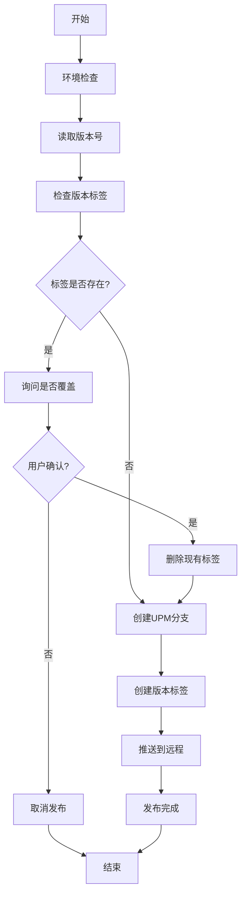

# FolderCommentTool 一键发布工具使用说明

## 📋 工具概述

`release.bat` 是 FolderCommentTool 项目的一键发布工具，用于自动化Unity插件的发布流程。该工具会自动读取版本号、创建UPM分支、打标签并推送到远程仓库。

## 🎯 主要功能

- ✅ **自动版本检测**：从 `package.json` 自动读取版本号
- ✅ **环境检查**：验证Git环境和必要文件
- ✅ **智能标签管理**：检查重复标签并提供覆盖选项
- ✅ **UPM分支创建**：使用 `git subtree` 分离插件目录
- ✅ **一键推送**：自动推送分支和标签到远程仓库
- ✅ **友好界面**：中文提示和进度显示

## 🚀 使用方法

### 前置条件

1. **Git环境**：确保Git已安装并可在命令行使用
2. **Git仓库**：在项目根目录下运行（包含.git文件夹）
3. **版本更新**：确保已更新 `Packages/FolderCommentTool/package.json` 中的版本号

### 操作步骤

1. **更新版本号**
   ```json
   // 编辑 Packages/FolderCommentTool/package.json
   {
     "version": "1.0.4",  // 修改为新版本号
     // ... 其他配置
   }
   ```

2. **运行发布脚本**
   ```bash
   # 在项目根目录下执行
   .\release.bat
   ```

3. **按提示操作**
   - 如果版本标签已存在，选择是否覆盖
   - 等待发布完成

## 📊 执行流程



## 🔧 工具配置

### 可配置参数

在 `release.bat` 文件中可以修改以下参数：

```batch
SET ToolName=upm                             # UPM分支名称
SET ToolAssetPath=Packages/FolderCommentTool  # 插件路径（Git用）
SET ToolAssetPathWin=Packages\FolderCommentTool # 插件路径（Windows用）
```

### 版本号格式

支持标准的语义化版本号格式：
- `1.0.0` - 主版本.次版本.修订版本
- `1.0.0-beta.1` - 预发布版本
- `1.0.0+build.1` - 构建元数据

## ⚠️ 注意事项

### 使用前检查

1. **确保工作目录干净**
   ```bash
   git status  # 检查是否有未提交的更改
   ```

2. **确认版本号正确**
   - 版本号应该递增
   - 遵循语义化版本规范

3. **网络连接**
   - 确保可以访问Git远程仓库
   - 检查Git推送权限

### 常见问题

#### 1. Git环境问题
```
❌ 错误: Git 未安装或不在PATH中
```
**解决方案**：安装Git并确保添加到系统PATH

#### 2. 路径问题
```
❌ 错误: 找不到 package.json 文件
```
**解决方案**：确保在项目根目录下运行脚本

#### 3. 权限问题
```
❌ 错误: 推送失败
```
**解决方案**：检查Git远程仓库权限和网络连接

#### 4. 版本冲突
```
⚠️ 警告: 标签 1.0.3 已存在
```
**解决方案**：选择覆盖现有标签或更新版本号

## 📈 优化建议

### 已实现的优化

1. **进度显示**：6步骤进度指示器
2. **错误处理**：详细的错误信息和解决建议
3. **用户体验**：Emoji图标和中文界面
4. **静默输出**：减少不必要的Git命令输出
5. **智能检查**：多层次的环境和文件检查

### 未来可能的改进

1. **回滚功能**：发布失败时自动回滚
2. **配置文件**：支持外部配置文件
3. **多分支支持**：支持发布到不同分支
4. **自动测试**：发布前运行自动化测试
5. **变更日志**：自动更新CHANGELOG.md

## 🔗 相关链接

- **项目仓库**：https://github.com/fenglyu1314/FolderCommentTool
- **UPM安装**：`https://github.com/fenglyu1314/FolderCommentTool.git#upm`
- **问题反馈**：https://github.com/fenglyu1314/FolderCommentTool/issues

## 📝 版本历史

- **v1.0.0**：初始版本，基本发布功能
- **v1.1.0**：添加环境检查和错误处理
- **v1.2.0**：优化用户界面和进度显示
- **v1.3.0**：适配插件目录迁移到Packages目录

---

*最后更新：2025-01-23*
